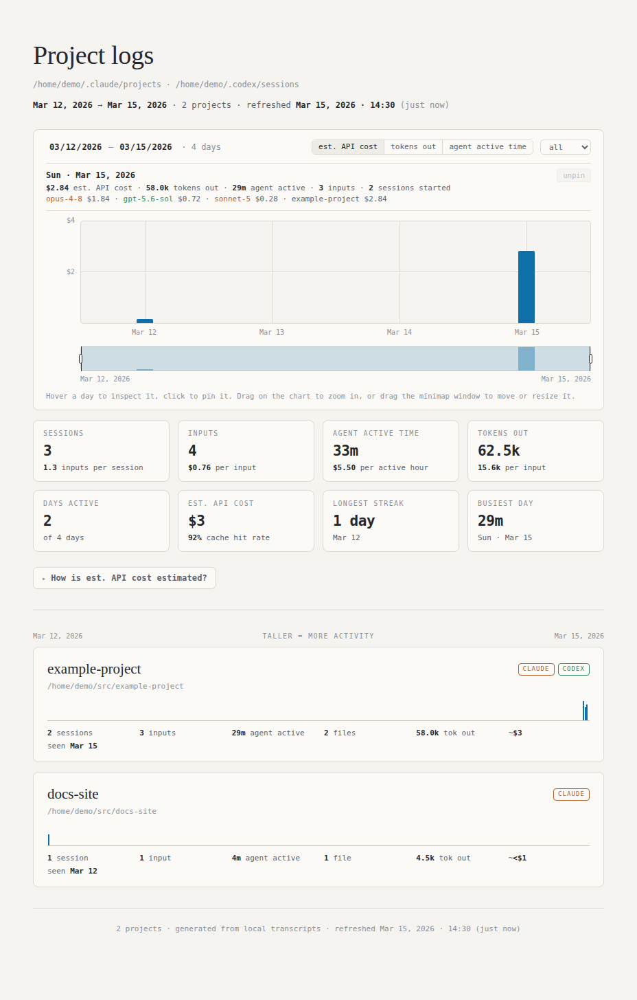
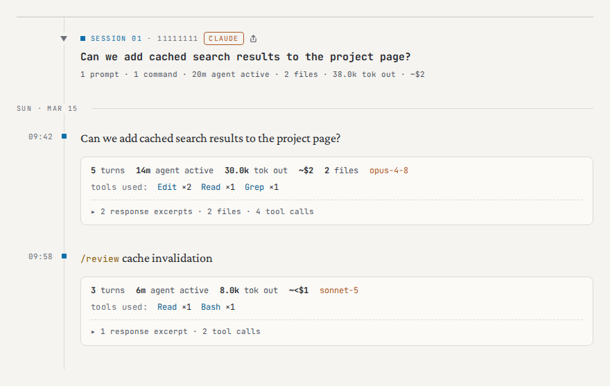
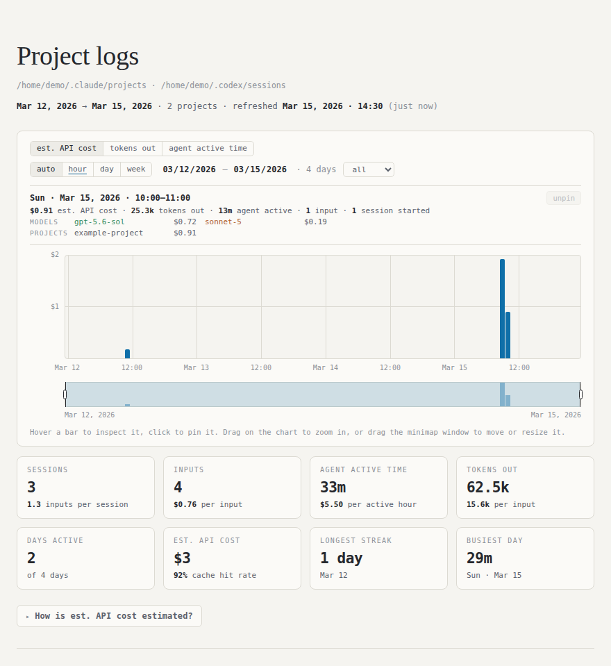
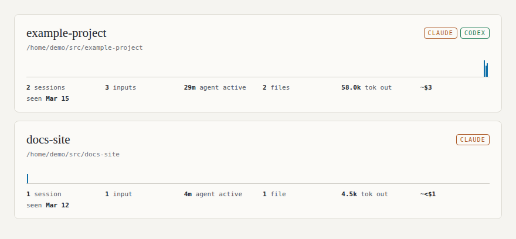
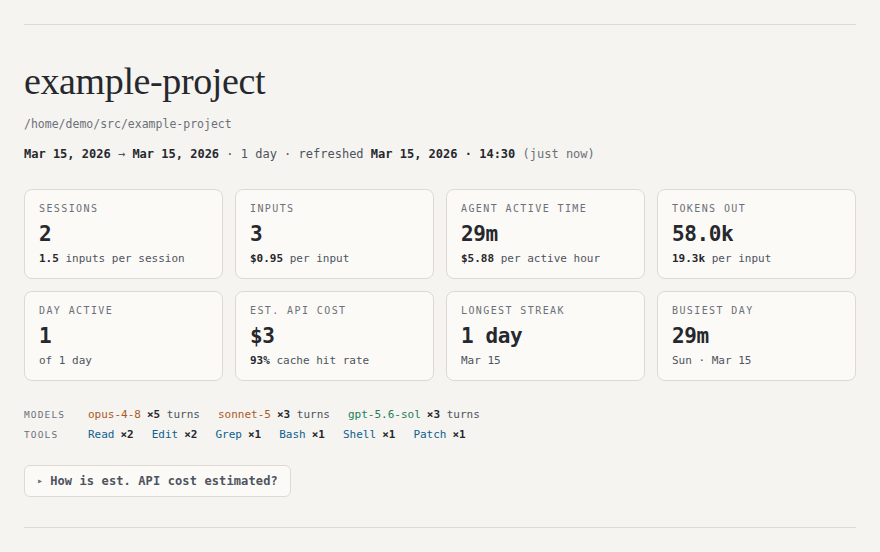
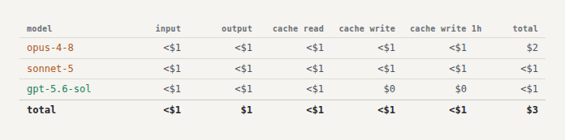

# session-atlas

session-atlas turns local Claude Code and Codex CLI transcripts into static HTML
timelines.

The project index summarizes activity across projects.

<p align="center"></p>

Each project page shows prompts and the assistant activity that followed them,
including tool use, changed files, token usage, [recorded or estimated active
time](#usage-and-cost-accounting), and estimated cost.

The model chips on a project page show assistant-turn counts attributed to each
model; those numbers are not session counts. Branch names remain parser metadata
but are not displayed as page badges.

<p align="center"></p>

## Quick start

The site generator requires Python 3.9 or later on a Unix-like system such as
Linux or macOS. It uses only the Python standard library. Run the commands below
from the repository root.

### All projects

Generate a project index and pages for every project for which session-atlas
finds at least one timeline entry:

```bash
python3 generate_site.py --all
```

This command writes the project index to `site/index.html`. A `--all` render
also removes an obsolete `index.html` created by session-atlas. It then removes
the project's directory if that directory is empty. Files that session-atlas
did not create remain in place.

### Single project

Generate a page for one project by passing `generate_site.py` a project
directory name, also called its basename, or a repository path:

```bash
python3 generate_site.py example-project
python3 generate_site.py "$HOME/src/example-project"
```

The command writes the page under `site/` using a stable path-derived slug and
prints its exact `file://` URL. Open that URL in a browser. The page contains its
styles and scripts, so it works without a web server or network connection.

> [!NOTE]
> **Project lookup:** The site generator combines Claude Code and Codex CLI
> sessions when both tools recorded activity for the project. It can also find
> a Codex-only project by basename or repository path. For Claude Code, it also
> accepts the project's transcript directory under `~/.claude/projects/`.

## Privacy

> [!WARNING]
> Source transcripts, archives, and generated pages can contain prompts,
> assistant-response excerpts, local paths, shell commands, file names, Git
> branches, model identifiers, and usage data. Review them before sharing.

By default, the scripts read live transcripts and Codex history and diagnostics
from your home directory, access those files and any selected archive through
filesystem paths, write all output locally, and do not upload source data.

Git ignores `site/` and `archive/`. A normal clone therefore contains the
source code, tests, documentation, and optional systemd units, but it does not
contain your local transcripts, generated pages, or local archive.

The generator sets site directories to owner-only mode `0700` and generated
HTML and lock files to owner-only mode `0600`.

The committed documentation images are generated from synthetic transcript
fixtures under `tests/fixtures/transcripts/`. The screenshot workflow does not
read an existing `site/` or transcripts from a developer's home directory.

## Where to go next

> [!NOTE]
> The remaining sections are optional. Use this table to find the detail you
> need.

| Goal | Go to |
| --- | --- |
| See how the index and project pages are organized | [What the atlas shows](#what-the-atlas-shows) |
| Automate refreshes, archive transcripts, or inspect parser output | [Advanced tasks](#advanced-tasks) |
| Understand classification, timelines, and accounting | [Reference](#reference) |
| Run tests or refresh documentation images | [Development](#development) |

## What the atlas shows

These representative images show the project index, a project overview,
expanded cost details, and session content.

### Project index summary

The top of the project index summarizes activity across every project and links
to the method and token counts behind its cost estimate.



### Project index cards

The project index compares projects on a shared time axis. Source badges
distinguish a project with both Claude Code and Codex CLI sessions from a
Claude-only project.



### Project overview

An individual project page summarizes its sessions, activity, models, tools,
and estimated cost. An expandable panel explains the estimate and breaks it
down by model and token category.



### Expanded estimated cost

The expanded accounting control shows estimated cost by model and token
category in one table.



### Session content

Each session groups prompts with the assistant activity that followed them.
A `claude` or `codex` badge in the session header identifies the transcript
source. When an input receives multiple textual responses, the machine readout
shows the count and its expandable log contains bounded excerpts for each one.
Claude's shell input/output wrappers are condensed into one-line terminal
entries.


## Advanced tasks

### Refresh automatically with systemd

The optional units in `systemd/user/` refresh `site/` on the schedule defined by
`session-atlas-render.timer` on Linux systems with user-level systemd. Other
platforms require another scheduler. Before linking the units, inspect
`WorkingDirectory` and `ExecStart` in `session-atlas-render.service`. Set them
for this checkout and its Python 3 interpreter, and add any nondefault `--out`
or `--archive` options.

Install and start the timer from the repository root:

```bash
systemctl --user link \
  "$PWD/systemd/user/session-atlas-render.service" \
  "$PWD/systemd/user/session-atlas-render.timer"
systemctl --user daemon-reload
systemctl --user enable --now session-atlas-render.timer
systemctl --user start session-atlas-render.service
```

Check the schedule and the most recent render:

```bash
systemctl --user list-timers session-atlas-render.timer
systemctl --user status session-atlas-render.service
```

Generated project and index pages show their refresh time in the header and
footer.

The supplied timer renders only. Automatic archiving is a separate opt-in
because archived copies can outlive source cleanup. Configure an archive job
using the destination and privacy procedure below.

### Archive transcripts

Use `archive_transcripts.py` to preserve Claude Code session files and Codex CLI
rollout files when source files might be cleaned up or a tool reinstalled:

```bash
python3 archive_transcripts.py
```

By default, `archive_transcripts.py` writes a retention archive under
`archive/`. It copies new or larger source files atomically, never deletes an
archived session, and never replaces a fuller archived copy with a smaller
source. Archive directories use owner-only mode `0700`, and files use `0600`.
This is not a redaction workflow, and the command provides no automated
replacement or deletion operation. To remove sensitive data, stop scheduled
archiving, remove or redact the live source, then deliberately remove every
archive and backup copy before resuming.

A local mirror does not protect against disk or machine loss. Write the archive
to storage that is backed up or mounted from another device when you need that
protection:

```bash
python3 archive_transcripts.py --dest /mnt/backup/session-atlas
```

Replace `/mnt/backup/session-atlas` with a path on backed-up or separately
mounted storage. Pass the same path when rendering:

```bash
python3 generate_site.py --all --archive /mnt/backup/session-atlas
```

For timer-driven renders, add the same `--archive` value to `ExecStart` in
`session-atlas-render.service` and run `systemctl --user daemon-reload`.
Otherwise, the service continues to use `generate_site.py`'s CLI default.

`generate_site.py --all` reads the union of live transcripts and the selected
archive root, then deduplicates sessions. The archive can contain private data.

The archiver does not copy `~/.codex/history.jsonl` or
`~/.codex/logs_2.sqlite`, so it does not preserve prompts recovered from those
history sources. Back up those files separately if you need them.

### Inspect Claude Code statistics

`ccx_parse.py` provides a lower-level view of one Claude Code project:

```bash
python3 ccx_parse.py example-project
```

It prints aggregate statistics as JSON, then reports how many timeline
milestones and sessions it found. An input milestone groups one human input
with the assistant activity that occurred before the next input. The parser can
also retain substantive activity that occurs before a session's first input.

If a transcript contains malformed JSON or a record that is not UTF-8, the
parser warns with the file and line number, skips that record, and continues.
Generated project pages and index cards show the number of skipped records so a
partial render is not mistaken for a complete one.

### Inspect Codex CLI statistics

`codex_parse.py` prints one summary row per discovered Codex project, followed
by the project count and parse time:

```bash
python3 codex_parse.py
```

## Reference

### Input classification

session-atlas counts free-text prompts and slash commands typed in top-level
sessions as inputs. It also counts a Codex prompt recovered without a rollout
as an input labeled `recovered`. It excludes CLI-injected records and
child-agent assignments, while retaining supported child-agent activity and
token usage in project totals. Substantive activity before the first retained
input can appear as a non-prompt entry. Recovery sources do not contain the
assistant reply or enough structured tool, token, or cost data to attribute the
recovered activity. Recovered prompts are typically associated with Codex
`/btw` forks, but not always; the available history does not establish that
source for an individual prompt. See
[Transcript formats](docs/transcript-formats.md) for source paths, record
fields, and parser mappings.

Session totals count non-automated conversations. Codex child-agent rollouts
with a known parent are shown as timestamped activity entries inside that
parent session, like nested Claude Code work. Orphaned child rollouts and
`codex exec` remain separate automated sections and are shown in the timeline;
their count is available as `automated_sessions`.

### Timeline behavior

#### Sessions and navigation

Project pages group retained top-level Claude Code sessions and Codex CLI
rollouts into separate sections. Nested Claude Code child transcripts add their
token totals to the entry that started them instead of creating another
section. Codex child rollouts with a known parent use the same presentation:
their work is retained in a timestamped `triggered <agent> subagent` entry in
the parent session.

Entries and session headings use opaque, source-backed anchors. Their values do
not depend on the session or entry display numbers, so adding another tracked
conversation does not retarget an existing link.

The sticky bar shows the current session title. Use its previous and next
buttons, or `j` and `k`, to move between sessions. Click the project name to
return to the top, and click the session title to jump to that session. Click
the top ribbon to jump to the nearest timeline entry on its chronological axis.
On wide screens, click or drag the right-hand minimap to scroll through the
page. Very large pages (more than 1,000 timeline entries) omit the minimap so
its navigation nodes do not add to the page's loading work, but retain the
right-hand gutter so switching between project pages does not shift the layout.

#### Charts and timestamps

The top ribbon places entries from all sections on one chronological axis and
colors them by session. The right-hand minimap uses square-root-scaled tick
widths for entries with more active time, or more output tokens when timing data
is unavailable. The project index uses square-root-scaled bar heights for
active time, with output tokens as the fallback when timing data is unavailable.

The generator renders timestamps in the local timezone of the machine that
runs it. Transcript timestamps are stored in UTC.

#### Automated sessions

Automated rollouts are transcript-level work units for delegated Codex subagents
or non-interactive `codex exec` tasks, not additional human conversations.
Codex CLI sessions from temporary `codex exec` working directories are grouped
under the interactive checkout when their Git remotes match. Project pages hide
`codex exec` and orphaned child-agent sessions as separate sections. Child-agent
work with a known parent is placed in that parent's timeline instead of becoming
a separate section. Automated sections are marked in the timeline and included
in the ribbon and minimap. The project summary's session card counts
non-automated conversations, while the timeline and navigation show all retained
sections.
Prompts, commands, recovered prompts, activity statistics, token totals, and
estimated cost continue to include hidden automated sessions.

#### Claude Code project paths

Claude Code's munged directory names are lossy because path separators and real
dashes both become `-`. The parser uses the `cwd` field from a transcript record
when available. Otherwise, it reconstructs a best-effort path from the munged
directory name.

#### Project output directories

Project pages display the original project name and path, but the generator
writes each page under a restricted ASCII slug: a readable basename plus a
stable hash suffix derived from the full path. Single-project and `--all` runs
therefore use the same directory without storing a path manifest, and projects
with matching basenames cannot overwrite one another. The generator rejects
unsafe slugs and existing project-directory symlinks instead of writing outside
`--out`.

### Usage and cost accounting

Claude Code token totals come from assistant `usage` fields, and duration totals
come from system `turn_duration` records. Codex CLI token totals come from
changes in cumulative `token_count` records. Because Codex does not record turn
durations, the parser estimates active time from each input timestamp through
the last activity record before the next input.

Cost is an estimate based on the per-model list rates in `pricing.py`. The
expandable accounting panel explains each token category and shows the rates
used. `pricing.py` owns the exact rates and their `AS_OF` date. The estimate
excludes batch, priority, long-context, volume, and enterprise pricing.

A dollar figure ending in `+` is partial because at least one model has no
listed rate. The accounting panel shows each unpriced model and its token count;
add the missing model to `pricing.py` to include its cost. The page labels a
complete figure `est. cost` and a partial figure `partial est. cost`.

## Development

Run the test suite from the repository root:

```bash
python3 -m unittest discover -s tests -v
```

The screenshot workflow requires Node.js 20 or later. Install the exact
Playwright version in `package-lock.json` and its Chromium build, then refresh
the README screenshots:

```bash
npm ci
npm run screenshots:install
npm run screenshots
```

`npm run screenshots` invokes `scripts/capture-readme-screenshots.sh`, the
supported image-refresh entry point. It builds and captures only the synthetic
fixture site described in [Privacy](#privacy).

To profile a generated page before and after a rendering change, use the
committed headless-browser profiler. Pass the same page path and sample count
to both revisions:

```bash
npm run profile:page -- site/<project-slug>/index.html --repeats 2
```

It reports navigation timing, DOM and content counts, browser node and heap
usage, script/style/layout time, and the sizes of response and tool-log markup.
Run the unchanged page twice first to establish the browser's noise floor.

The main files have these roles:

| Path | Purpose |
| --- | --- |
| `generate_site.py` | Generates project pages and the all-project index. |
| `ccx_parse.py` | `build_timeline()` resolves Claude Code projects and builds their timelines. |
| `codex_parse.py` | `build_codex_timelines()` builds timelines from Codex CLI rollout files. |
| `archive_transcripts.py` | Implements transcript archiving and its retention policy. |
| `pricing.py` | Applies the model rates in `estimate_cost()`. |
| `scripts/capture-readme-screenshots.sh` | Runs the supported synthetic-fixture screenshot workflow. |
| `scripts/profile-page.js` | Profiles a generated page's browser load and DOM costs. |
| `tests/fixtures/transcripts/` | Holds invented Claude Code and Codex CLI records for parser and screenshot tests. |
| `docs/transcript-formats.md` | Documents transcript fields and parser mappings for future parser changes. |

## License

session-atlas is available under the [MIT License](LICENSE).
